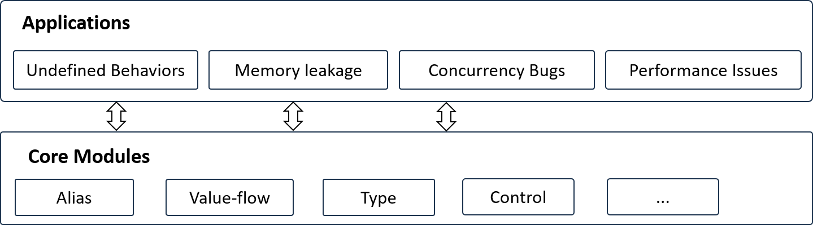

# Chapter 1. Introduction
Writing program analysis tools is challenging. In this project, we aim to provide a user-friendly framework for developing new static program analysis features for Rust. In particular, our project integrates dozens of classic program analysis algorithms, including those for pointer analysis, value-flow analysis, control-flow analysis, and more. Developers can choose and combine them like Lego blocks to achieve new bug detection or verification capabilities.

The following figure demonstrates the framework of RAP, which is composed of a core layer and an application layer. Note that the project is still under heavy development, and some modules are not available yet.

