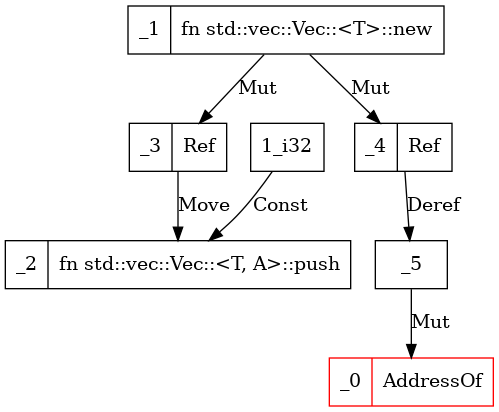

# Chapter 5.3. Value-flow Analysis
Value-flow analysis tracks value flow in the program including copy, move, ref, and other scenarios. With this module, users can easily have a whole picture of the value flow in any function and query whether there is value dependency between two mir local variables.

This module defines a graph data structure to store the data parsed from Rust mir. The graph nodes are indexed by `Local` which is defined by rustc. The edges between the nodes also define the data dependency relationship.


## Quick Usage Guide
Developers can test the feature using the following command:
```shell
cargo rap -dataflow
```

To switch in debug mode and draw the graph with `graphviz`, execute the following command.
```shell
cargo rap -dataflow=debug
```

For example, we can apply the value flow analysis to the `dangling_min` case, and the result of function `create_vec` is as follows:
```rust
fn create_vec() -> *mut Vec<i32> {
    let mut v = Vec::new();
 //Fix: let mut v = Box::new(Vec::new());
    v.push(1);
    &mut v as *mut Vec<i32>
 //Fix: Box::into_raw(v)
}
```
<div align="center"></div>

To utilize the analysis results in other analytical features, developers can use mop as follows:
```rust
use analysis::core::dataflow::Dataflow; // import the module
let dataflow = Dataflow::new(tcx); // create a dataflow object
dataflow.build_graphs(); // parse all the functions in tcx and build corresponding graphs
```

### Graph APIs

#### DFS
This function uses precedence traversal. The node operator and edge validator decide how far the traversal can reach. `traverse_all` decides if a branch finds the target successfully, and whether the traversal will continue or not.

For example, if you need to instantly stop the traversal once finding a certain node, then set `traverse_all` to false.
If you want to traverse all the reachable nodes which are decided by the operator and validator, then set `traverse_all` to true.

```rust
pub fn dfs<F, G>(&self, now: Local, direction: Direction, node_operator: &mut F, edge_validator: &mut G, traverse_all: bool) -> DFSStatus
where 
 F: FnMut(Local) -> DFSStatus,
 G: FnMut(&EdgeOp) -> DFSStatus
```

#### is_connected

This function is built upon the `DFS` API. It tries to find `idx_2` from `idx_1`, upside first then downside.

```rust
pub fn is_connected(&self, idx_1: Local, idx_2: Local) -> bool
```
