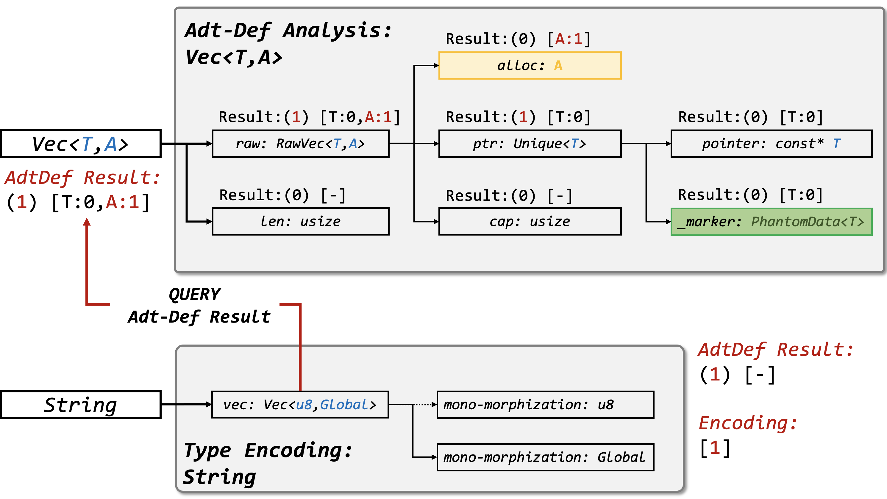
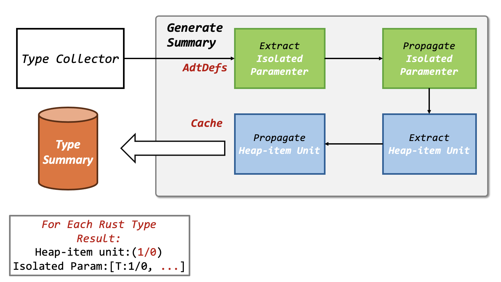

# Chapter 5.5. Type Analysis
Here we first give several definitions for further usage in this section. These definitions can been referred in the paper of `rCanary`.

* **Heap Item**: A heap item is an object containing the heap allocation with a fixed type (layout).
* **Heap-item Unit**: A heap-item unit has a `PhantomData<T>` field with a typed generic parameter and a pointer field to store the value `T`.
* **Isolated Parameter**: An isolated parameter is a stand-alone and typed generic parameter (e.g., `T` but not `&T`). 

In the type analysis, we need to generate an abstraction for all rust types used in the local crate and dependencies. Each type has a **layout summary** to illustrate the data abstraction in the **fully initialized state**.

The summary comprises two parts:
1. **a boolean value** indicating if it contains a heap item;
2. **a boolean vector** indicating if each generic parameter is an isolated parameter.

For example, the summary of the vector `Vec<T,A>` is `(1) [0, 1]`.



## Overview
We give the overall framework of type analysis as below.



Then we will discuss the workflow of each component in this figure.

The `visitor` method is main pass of the constructor part in type analysis, it will perform several important procedural
to determine whether an adt definition (adt-def) will occupy at least one heap allocation, reflecting holding heap-ownership
in OBRM system.

For example, given an `AdtDef` (like `Vec<T>`), the result of `visitor` contains two parts:

* pt1 Enum:  `{Owned / UnOwned}` indicates whether it will directly have a heap data
* pt2 Array: `[bool;N]` indicates whether each generic parameter will have a raw parameter

Those parts can accelerate heap-ownership inference in the data-flow analysis.

From the top-down view, `visitor` has several sub-phases which means it contains multiple sub-visitors to make whole method `self.visitor()` work.

## Type Collector
We use an inter-procedural visitor to collect all the types for local crate and the types are after monomorphism. Our goal is to extract all the `AdtDef`s.

The struct `core::heap_item::TypeAnalysis` implements `mir::Visitor`.
```rust
pub struct TypeAnalysis<'tcx, 'a> {
    rcx: &'a mut rCanary<'tcx>,
    fn_set: Unique,
    ty_map: TyMap<'tcx>,
    adt_recorder: Unique,
}
```
> Note: the type in this phase is `Ty::ty` rather of `Hir::ty`.

As we can see, the function `visit_ty` will flatten all the fields and generics appeared. It can cover almost all the rust types.
```rust
impl<'tcx, 'a> TypeAnalysis<'tcx, 'a> {
    fn visit_ty(&mut self, ty: Ty<'tcx>, ty_context: TyContext) {
        match ty.kind() {
            TyKind::Adt(adtdef, substs) => {
                // ...
                for field in adtdef.all_fields() { self.visit_ty(field.ty(self.tcx(), substs) ,copy_ty_context(&ty_context)) }
                for ty in substs.types() { self.visit_ty(ty, copy_ty_context(&ty_context)); } },
            TyKind::Array(ty, ..) => { self.visit_ty(*ty, ty_context); },
            TyKind::Slice(ty) => { self.visit_ty(*ty, ty_context); },
            TyKind::RawPtr(typeandmut) => { let ty = typeandmut.ty; self.visit_ty(ty, ty_context); },
            TyKind::Ref(_, ty, ..) => { self.visit_ty(*ty, ty_context); },
            TyKind::Tuple(tuple_fields) => {
                for field in tuple_fields.iter() {
                    self.visit_ty(field, copy_ty_context(&ty_context));
                } },
            _ => return,
        }
    }
}
```

The `AdtDef` are finally stored in the field `adt_recorder`.  After the collecting all `AdtDef`, we have 4 sub-phases to generate the summary for each type.
```rust
start_channel(|did| self.extract_isolaoted_parameter(did), &dids);
start_channel(|did| self.extract_isolaoted_parameter_prop(did), &dids);
start_channel(|did| self.extract_heap_item_unit(did), &dids);
start_channel(|did| self.extract_owner_prop(did), &dids);
```
---

## Phase I: Extract Isolated Parameters
Extract isolated params in adt types, the `param` means one generic parameter acting like `T`, `A`, etc...

In the sub-visitor `heap_item::IsolatedParameter`, it will visit the given type recursively, and extract all params to construct a mapping.
```rust
#[derive(Clone)]
struct IsolatedParameter<'tcx> {
    tcx: TyCtxt<'tcx>,
    parameters: Parameters,
}
```

Note we only interest in `isolated params` (`T` not like `*mut T`). It lies in **one-entire field** | **recursive in tuple** | **recursive in array** | **mixed before**.

The implementation can be found in function `extract_raw_generic` and trait impl `impl TypeVisitor for IsolatedParameter`.

Here, we give some examples of extracting isolated parameters. Given a struct `Example<A, B, T, S>`:

```rust
 struct Example<A, B, T, S> {
        a: A,
        b: (i32, (f64, B)),
        c: [[(S) ; 1] ; 2],
        d: Vec<T>,
}
```

The final result for `<A, B, T, S>` is `<true, true, false, true>`.

## Phase II: Propagate Isolated Parameter 
Extract all params in the adt types like param `T` and then propagate from the bottom to top.

This procedural is the successor of extracting isolated parameters, and the key point of IsolatedParameterPropagation is to propagate params from bottom `AdtDef` to the top as well as updating `TypeAnalysis Context`.

> Note that it will thorough consider mono-morphization existed in the `AdtDef`. That means the type `Vec<T>`, `Vec<Vec<T>>` and `Vec<i32>` are different!!!!

Given a struct `Example<A, B, T, S>`:
```rust
struct X<A> {
        a: A,
}
struct Y<B> {
    a: (i32, (f64, B)),
    b: X<i32>,
}
struct Example<A, B, T, S> {
    a: X<A>,
    b: (i32, (f64, B)),
    c: [[(S) ; 1] ; 2],
    d: Vec<T>,
}
```
The result for `X<A>` is `<true>`, for `Y<B>` is `<true>`, and for `Example<A, B, T, S>` is `<true, true, false, true>`.

## Phase III: Extract Heap-item Unit
Next, we need to extract all types that has `PhantomData<T>` inside which `T` must be a isolated parameter. Consider these types as a unit to guide the traversal over adt types.

As for one heap-item unit, only struct will contains the information that we want like
```rust
// Example:
struct Foo<T> {
    NonNull<T>,      // this indicates a pointer
    PhantomData<T>,  // this indicates a ownership
}
```
In fact, the Heap-item unit we defined here needs to meet the following three criteria:
1. Within the current struct, there must be a `PhantomData`.
2. The generic parameter of this `PhantomData` cannot be a reference.
3. There is a pointer field, and the type of the pointer field matches that of `PhantomData`.

Thus, we mark each found data of this type as a Heap-item Unit.

## Phase IV: Propagate Heap Item Result
All processes in step 4 are the same as in step 2, except that the search content changes from "isolated parameters" to "heap-item unit", corresponding to the implemented for `core::heap_item::OwnerPropagation`.
```rust
#[derive(Clone)]
struct OwnerPropagation<'tcx, 'a> {
    tcx: TyCtxt<'tcx>,
    ownership: RawTypeOwner,
    unique: Unique,
    ref_adt_owner: &'a AdtOwner,
}
```

# APIs Provided
To facilitate the use of the above analysis results, we provide the following well-packaged APIs for users to use, each API is configured with comprehensive documentation and usage instructions.

1. `core::heap_item::IsolatedParameter` is used to determine if the type has an isolated parameter.
2. `core::heap_item::HeapItem` is used to determine if the type has a heap item.
3. `core::heap_item::Encoder` encodes the type into a binary vector of `0-1`.

All the above structures are ZSTs, constructing the structure does not incur any additional overhead.

Its method requires at least 2 parameters, namely the global context of `rcx` for rCanary and the type `ty`. We also provide a series of APIs to check if composite structure types' fields and variants meet specific requirements or directly obtain all analysis results.