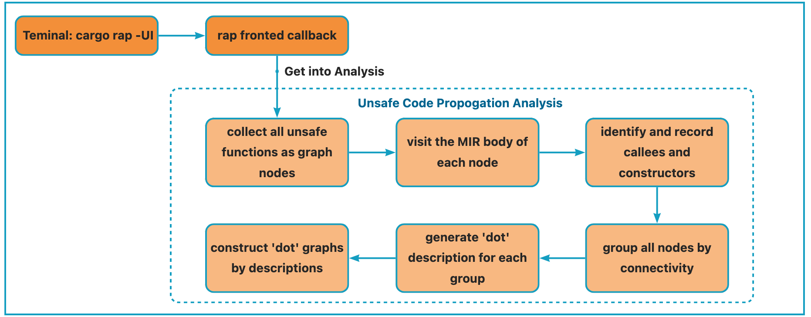

## Chapter 6.3. Unsafety Code Audit
The unsafety propogation graph(UPG) is a novel method to model the essential usage and encapsulation of unsafe code. UPG combines the traditional call graph with unsafe and dataflow information from Rust to capture the use and propagation of unsafe code across the project.

Within the UPG, there contains four major isolation types and nine structural patterns to split a UPG into several small self-contained subgraphs. These subgraphs called unsafety isolation graphs(UIGs) can serve as useful audit units for examining the soundness of unsafe code encapsulation.

We will continue to explore and investigate more effective applications of UIG in the encapsulation of unsafe code in our subsequent research.

**Before using this feature, make sure that `graphviz` is installed on your device**

### usage
Get into the same directory as cargo.toml and run the cmd below from the teminal. Then 'rap' will create a directory named 'UPG' in the same level, which contains several connected unsafety propogation graphs.
```
cargo rap -UI
```

### framework
The overall framework of this feature is consistent with rap's frontend framework. See the picture below for details.

