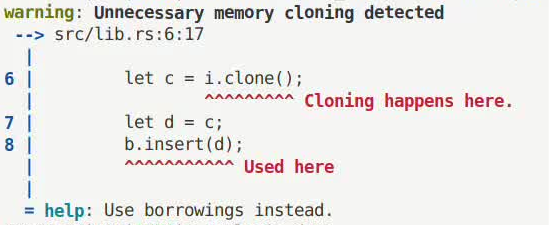

# Chapter 7.1 A Qucik Start of Log APIs

## Library Usage

We use `annotate_snippets` to render code snippets with underlines and messages. The document is available at [annotate_snippets](https://docs.rs/annotate-snippets/latest/annotate_snippets/) which is really easy to follow.

```rust
let message = Level::Error.title("expected type, found `22`").snippet( //the title of the message
    Snippet::source(source) //the source code
        .line_start(26) //the line number from which the target code starts
        .origin("examples/footer.rs") //the filename of the source code
        .fold(true) //whether to fold the source code or not
        .annotation(
            Level::Error //message level
                .span(193..195) //the underbound and the upperbound are offsets from the starting line
                .label("expected struct `annotate_snippets::snippet::Slice`, found reference"), //the annotation to explain the underlined code
        )
        .annotation(Level::Info.span(34..50).label("while parsing this struct")), //add annotations like a chain
);
```

`line_start` is the starting line number of the code snippet you are interested in. The content before this line will be dropped and never count in the offset again. The `.span()` accepts a `Range` object whose upperbound and underbound are offsets from the first character of the starting line. The corresponing code segment will be underlined and annotated.

Some utilities are available for you to better use these APIs.

## Utilities to Deal with the Span Objects 

- `span_to_source_code(span: Span) -> String`: accepts a `Span` object and returns its corresponding source code.

- `span_to_first_line(span: Span) -> Span`: accepts a `Span` object and returns the span corresponing to the first line of its source code or extends the span to a entire line.

- `span_to_trimmed_span(span: Span) -> Span`: accepts a `Span` object and returns the span corresponding to **head-trimmed** source code.

- `span_to_filename(span: Span) -> String`: accepts a `Span` object and returns the filename of the source code.

- `span_to_line_number(span: Span) -> usize`: accepts a `Span` object and returns its line number in the source code.

- `relative_pos_range(span: Span, sub_span: Span) -> Range<usize>`: accepts two `Span` objects and return the relative position range between the two spans. This function is **unsafe** because of potential overflow. Users should make sure the spans have intersection.

## An Example

```Rust
fn report_used_as_immutable(graph: &Graph, clone_span: Span, use_span: Span)
```

We need to annotate two code spans i.e. `clone_span` and `use_span`. The source code and filename can be acquired from the APIs above.

```Rust
let code_source = span_to_source_code(graph.span);
let filename = span_to_filename(clone_span); //other spans also work here
```

Because there is no relationship between the `clone_span` and the `use_span`. So we use `graph.span`, the span of the total function, as the code background. Corresponding to this, `.line_start`  takes `graph.span` as its parameter. We use `relative_pos_range` to compute the relative poition range. Thus it takes `graph.span`, the background, and `clone_span`, the span to underline, as parameters.

```Rust
let snippet = Snippet::source(&code_source)
    .line_start(span_to_line_number(graph.span))
    .origin(&filename)
    .fold(true)
    .annotation(
        Level::Error
            .span(unsafe{ relative_pos_range(graph.span, clone_span) })
            .label("Cloning happens here."),
    )
```

Then we assemble the message with title and footer.

```Rust
let message = Level::Warning
    .title("Unnecessary memory cloning detected")
    .snippet(snippet)
    .footer(Level::Help.title("Use borrowings instead."));
```


The final code looks like:

```Rust
fn report_used_as_immutable(graph: &Graph, clone_span: Span, use_span: Span) {
    let code_source = span_to_source_code(graph.span);
    let filename = span_to_filename(clone_span);
    let snippet = Snippet::source(&code_source)
        .line_start(span_to_line_number(graph.span))
        .origin(&filename)
        .fold(true)
        .annotation(
            Level::Error
                .span(unsafe{ relative_pos_range(graph.span, clone_span) })
                .label("Cloning happens here."),
        )
        .annotation(
            Level::Error
                .span(unsafe{ relative_pos_range(graph.span, use_span) })
                .label("Used here"),
        );
    let message = Level::Warning
        .title("Unnecessary memory cloning detected")
        .snippet(snippet)
        .footer(Level::Help.title("Use borrowings instead."));
    let renderer = Renderer::styled();
    println!("{}", renderer.render(message));
}
```

And the message rendered looks like:


